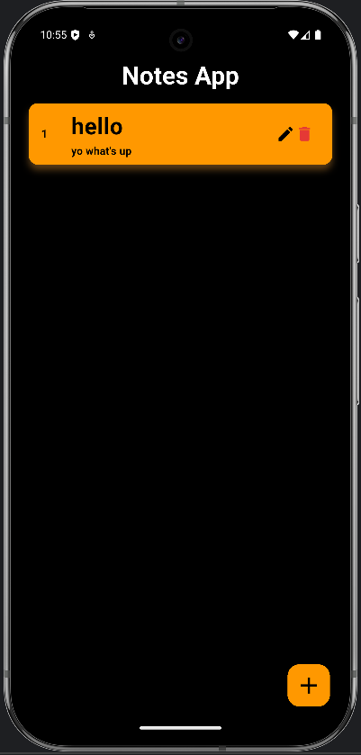
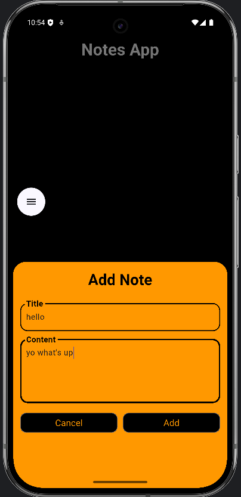
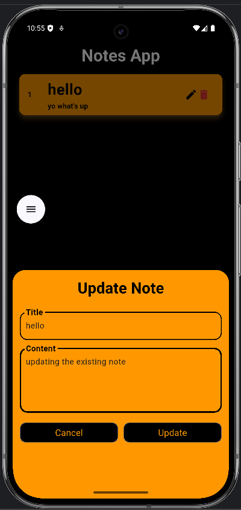

# 📒 Zen Note

A simple, dark-themed notes app built with Flutter.
This app lets you create, display, and manage notes — clean, minimal, and fully custom-built from scratch.
No copy-paste from tutorials — just raw dev grind. 💪

---
# 💡 Features (so far)
✍️ Create notes with a title & content

🧾 Display notes in a modern card layout

🗑️ Delete notes instantly

🔄 Edit notes (update functionality)

💀 Friendly empty state when no notes exist

🌑 Minimal & dark-themed design

💾 Local database storage with SQLite

---
# 📸 Preview

Select Operation:

Add Operation:

Update Operation:

---
# 🗓️ Progress Log
✅ Day 1:

- Project setup & UI layout

- Note creation logic added

- Dynamic ListView for displaying notes

- Delete functionality implemented

- Card-based design & empty state handling

✅ Day 4:

- Local DB with SQLite implemented

- Full CRUD operations (Create, Read, Update, Delete) working

✅ Day 5:

- Smooth input with showModalBottomSheet

- Polished edit/update functionality

---
# 💥 Developer Note

"Started with a blank screen, ended up building experiences. No shortcuts, just real grind. 🚀"

"Day 1: Already reached Day 3 goals. Real progress isn't scheduled, it's earned."

"Day 4: Local DB with SQLite added 🧠💾"

"Day 5: Made the modal bottom sheet scrollable and added padding to prevent keyboard obstruction and adding somthing to the screen."

---
## 💻 Tech Stack

- Flutter (Dart)

- SQLite (sqflite package)

- Path Provider (path package)

- Will integrate Firebase later for cloud backup.

---
## ⚡ Coming Soon
- 🔎 Live search functionality

- ✨ Better animations and UX improvements

- 🛡️ Cloud sync with Firebase

## 🤝 Contributing
Feel free to fork the repository and submit a pull request. All contributions and improvements are welcome!