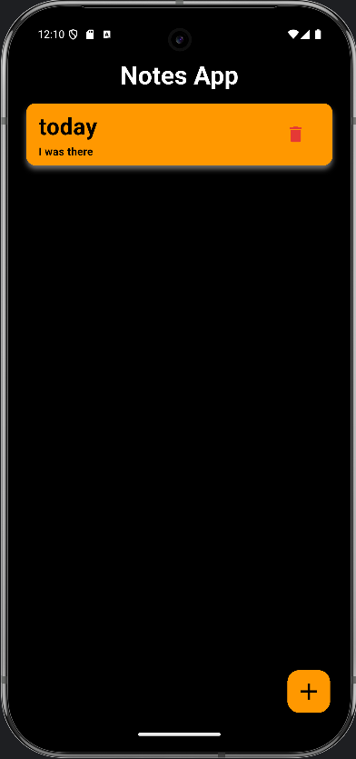
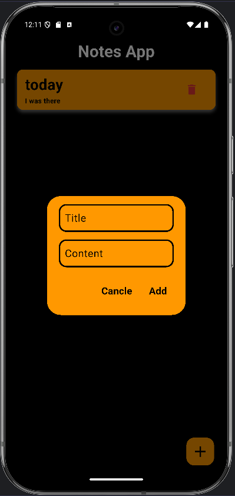

# 📒 Notes App

A simple, dark-themed notes app built with Flutter.
This app lets you create, display, and manage notes — clean, minimal, and fully custom-built from scratch.
No copy-paste from tutorials — just raw dev grind. 💪

---
# 💡 Features (so far)
✍️ Create notes with a title & content.

🧾 Display notes in a modern card layout.

🗑️ Delete notes instantly.

💀 Friendly empty state when no notes exist.

🌑 Minimal & dark-themed design.

---
# 📸 Preview

---
# 🗓️ Progress Log
✅ Day 1:

- Project setup & UI layout.

- Note creation logic added.

- Dynamic ListView for displaying notes.

- Delete functionality implemented.

- Card-based design & empty state handling.

---
# 💥 Developer Note
"Day 1: Already reached Day 3 goals. Real progress isn't scheduled, it's earned."

"Day 4: Yet to begin"
---
## 💻 Tech Stack

- Flutter (Dart)

- Firebase planned for future cloud storage.

